<h1 align="center">Dev Nagi</h1>

<i>Computer Science graduate student at Binghamton University, SUNY</i>

Open to software and machine learning engineering roles

I build agent tooling and full stack systems, and I care most about making them measurable.

<a href="https://portfolio-sandy-pi-24.vercel.app/"><b>Portfolio and Resume ↗</b></a>

### About

Most of what I build starts from the same annoyance: agent based systems tend to fail quietly. By the time you notice something is wrong, the actual cause is several tool calls and a couple of retries in the past, buried in a log nobody read. So a good chunk of my work is writing tools that make that failure visible again, plus a steady stream of full stack apps where I get to play with live systems: sockets, job queues, geospatial search, that kind of thing.

### Agent tooling

<table>
<tr>
<td width="50%">
<a href="https://github.com/DevNagi31/agent-autopsy">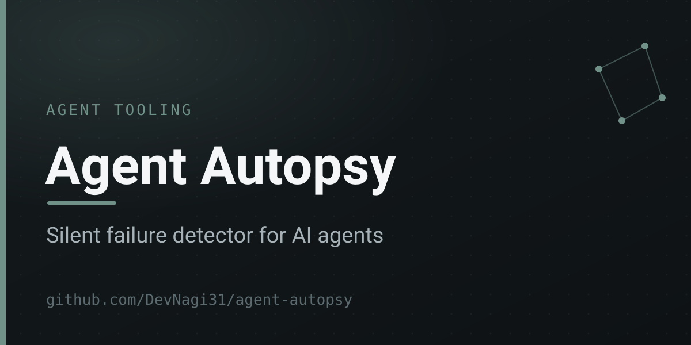</a>
 
<b><a href="https://github.com/DevNagi31/agent-autopsy">Agent Autopsy</a></b> 
Inspects AI agent traces and flags the failures that go unnoticed: hallucinated steps, swallowed errors, tool call loops, stale context. Parses LangChain, CrewAI, and OpenAI SDK output.
  
<code>Python</code>
</td>
<td width="50%">
<a href="https://github.com/DevNagi31/mcphub">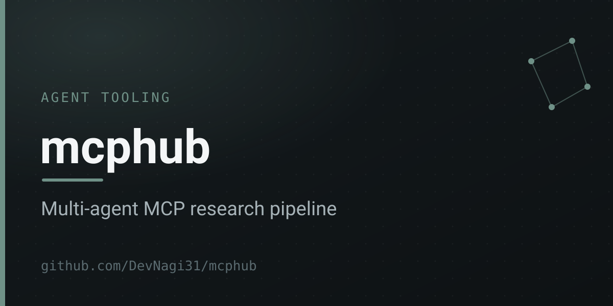</a>
 
<b><a href="https://github.com/DevNagi31/mcphub">mcphub</a></b> 
A research crew on Anthropic's Model Context Protocol. Researcher, analyst, writer, and fact checker pass a task down the line, each with its own tools, and the reasoning trace streams back live.
  
<code>TypeScript</code>
</td>
</tr>
<tr>
<td width="50%">
<a href="https://github.com/DevNagi31/agent-debugger">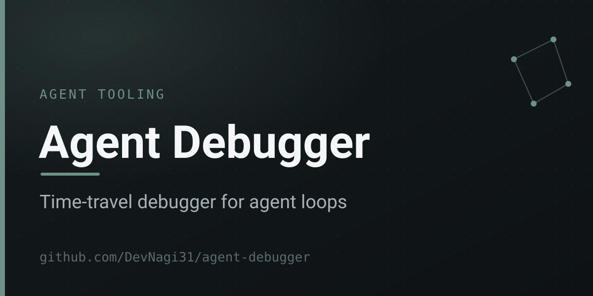</a>
 
<b><a href="https://github.com/DevNagi31/agent-debugger">Agent Debugger</a></b> 
A time travel debugger for agent loops. Grab any tool call in a run, edit its input or output, and replay execution from that exact point instead of rerunning the whole session.
  
<code>TypeScript</code>
</td>
<td width="50%">
<a href="https://github.com/DevNagi31/token-analysis">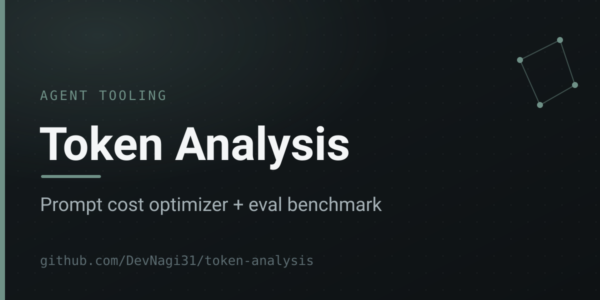</a>
 
<b><a href="https://github.com/DevNagi31/token-analysis">Token Analysis</a></b> 
A prompt cost optimizer and eval benchmark. Compresses prompts with rule based methods and an LLM, then scores semantic similarity against the original across ten models.
  
<code>TypeScript</code>
</td>
</tr>
</table>

### Full stack

<table>
<tr>
<td width="50%">
<a href="https://github.com/DevNagi31/devpulse">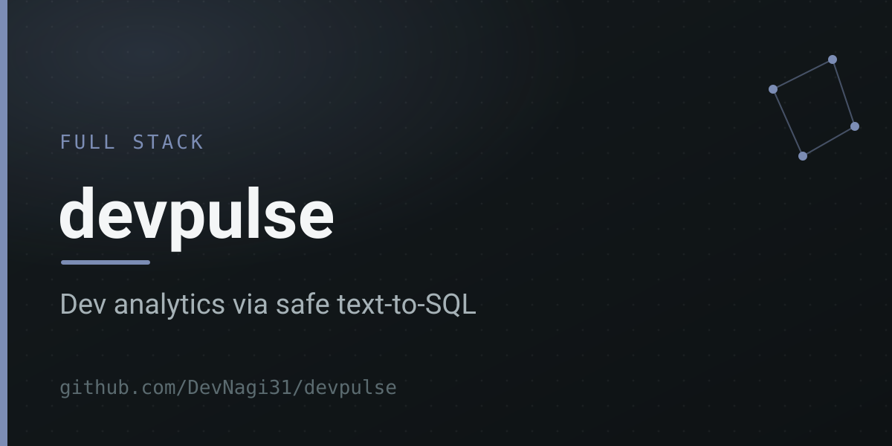</a>
 
<b><a href="https://github.com/DevNagi31/devpulse">devpulse</a></b> 
Developer analytics you can ask in plain English. Turns a question into SQL and runs it through AST checks first, so a generated statement can never touch anything it should not.
  
<code>TypeScript</code> &nbsp;·&nbsp; <a href="https://devpulse-orpin-five.vercel.app">Live demo ↗</a>
</td>
<td width="50%">
<a href="https://github.com/DevNagi31/eventhub">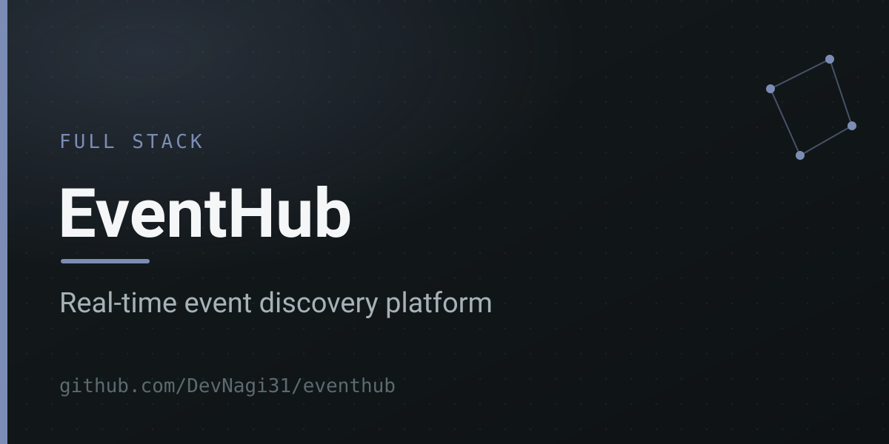</a>
 
<b><a href="https://github.com/DevNagi31/eventhub">EventHub</a></b> 
An event discovery platform. Faktory job queues, Haversine geospatial search, live chat over Socket.io, and a Claude recommendation layer. 15+ REST endpoints, Redis, Postgres.
  
<code>JavaScript</code>
</td>
</tr>
<tr>
<td width="50%">
<a href="https://github.com/DevNagi31/leetcode-arena">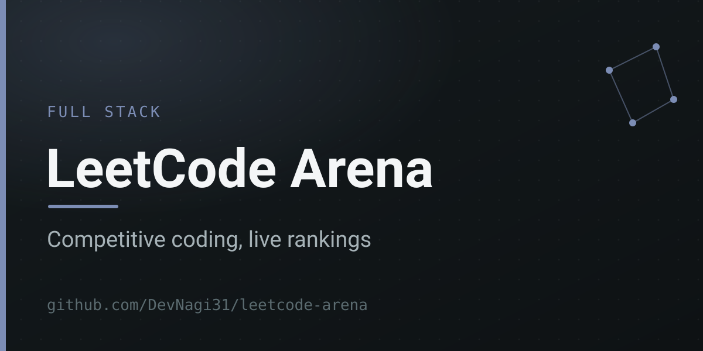</a>
 
<b><a href="https://github.com/DevNagi31/leetcode-arena">LeetCode Arena</a></b> 
A competitive LeetCode platform with live rankings, streak tracking, activity heatmaps, and university leaderboards. MERN stack, Socket.io for the live parts.
  
<code>JavaScript</code> &nbsp;·&nbsp; <a href="https://leetcode-arena-seven.vercel.app">Live demo ↗</a>
</td>
<td width="50%">
<a href="https://github.com/DevNagi31/url-shortner">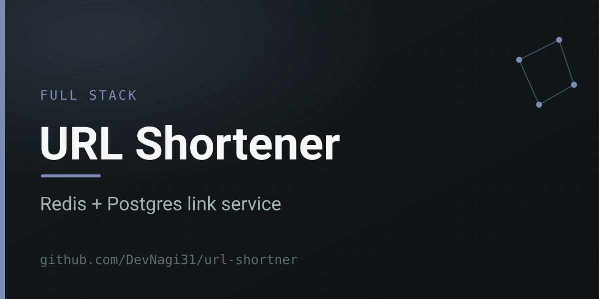</a>
 
<b><a href="https://github.com/DevNagi31/url-shortner">URL Shortener</a></b> 
A link shortening service backed by Redis for caching and Postgres for persistence.
  
<code>Redis · Postgres</code>
</td>
</tr>
</table>

### Collaboration and data

<table>
<tr>
<td width="50%">

 
<b><a href="https://github.com/DevNagi31/syncpad">syncpad</a></b> 
A collaborative Markdown editor that keeps working with no connection. Edits sync through Yjs CRDTs over server sent events and queue in IndexedDB while you are offline.
  
<code>TypeScript</code> &nbsp;·&nbsp; <a href="https://syncpad-delta.vercel.app">Live demo ↗</a>
</td>
<td width="50%">
<a href="https://github.com/DevNagi31/pulselab">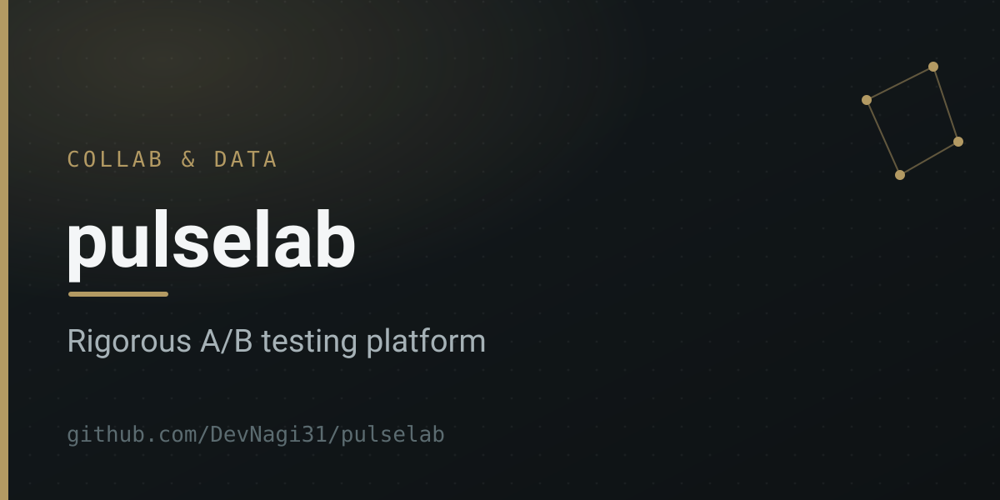</a>
 
<b><a href="https://github.com/DevNagi31/pulselab">pulselab</a></b> 
An experimentation platform for people who take A/B tests seriously. Always valid sequential testing, CUPED variance reduction, sample ratio mismatch detection, and a Monte Carlo proof.
  
<code>Python</code>
</td>
</tr>
<tr>
<td width="50%">
<a href="https://github.com/DevNagi31/chess-toxicity-analysis">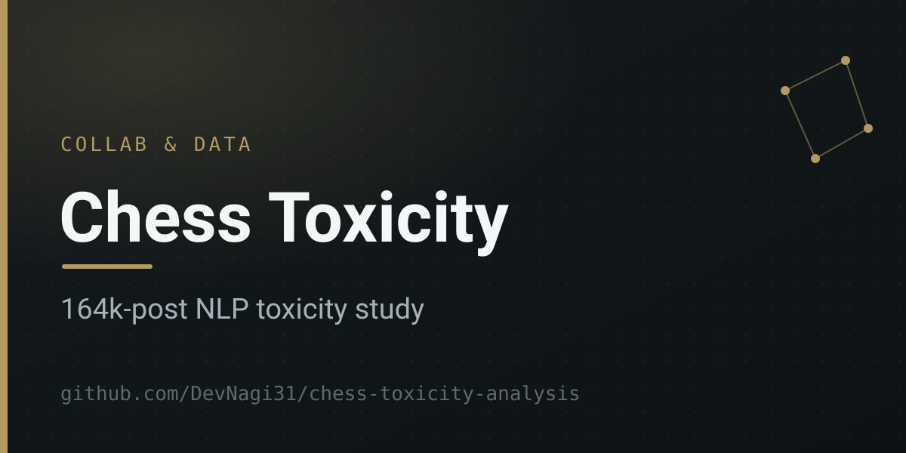</a>
 
<b><a href="https://github.com/DevNagi31/chess-toxicity-analysis">Chess Toxicity Analysis</a></b> 
An NLP project that ran 164,000+ posts from Reddit and 4chan through Google's Perspective API to measure toxicity in chess adjacent discourse. Flask dashboard, Postgres.
  
<code>Python</code>
</td>
<td width="50%">
<a href="https://github.com/DevNagi31/BU-Map">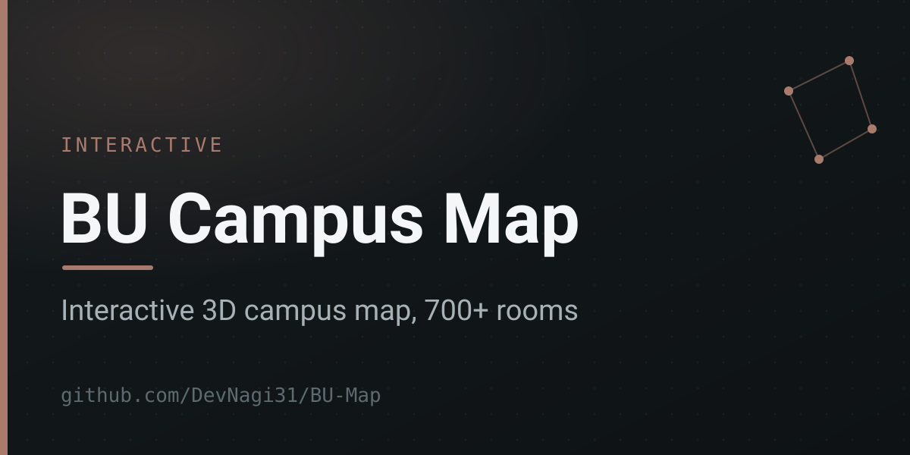</a>
 
<b><a href="https://github.com/DevNagi31/BU-Map">BU Campus Map</a></b> 
An interactive 3D map of the Binghamton University campus. 115 buildings, 700+ searchable rooms, GPS navigation, plus parking, dining, and bus routes on MapLibre GL JS.
  
<code>JavaScript</code>
</td>
</tr>
</table>

### Tools I reach for

 &nbsp;
 &nbsp;

